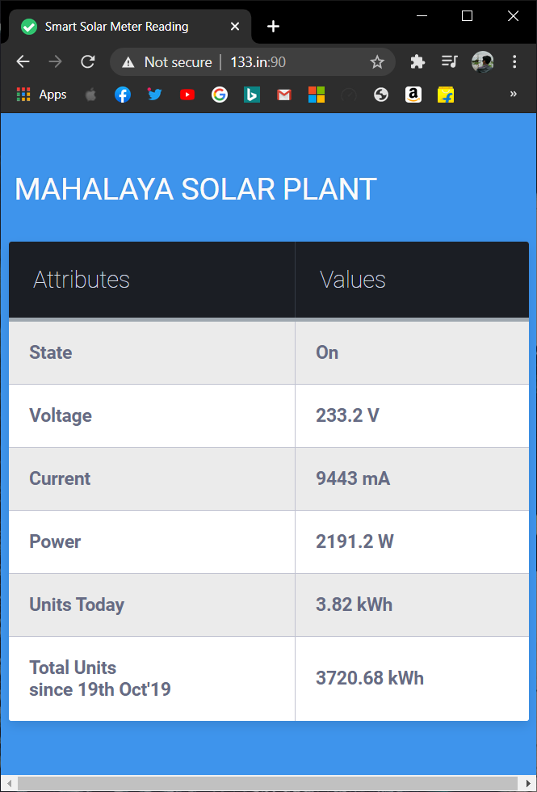
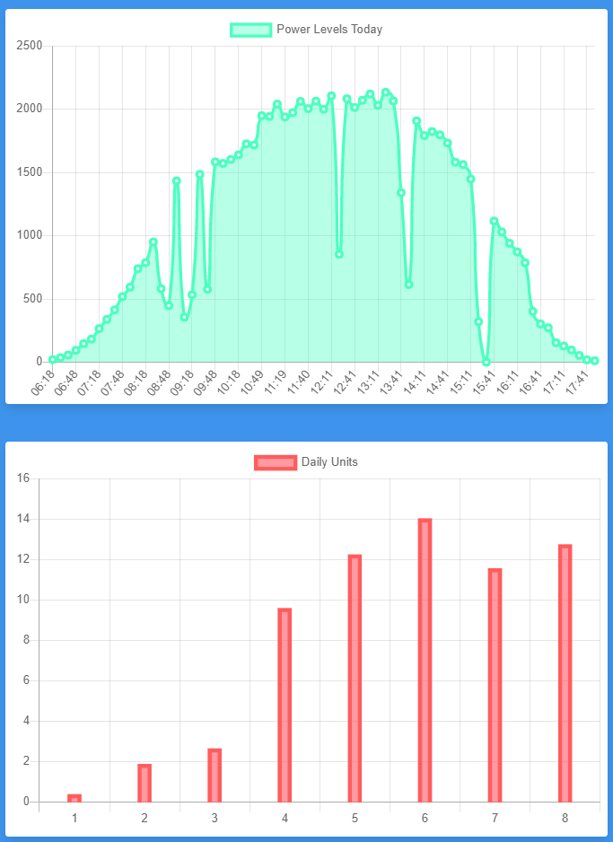

# SmartEnergyMeter_Tuya
Code to poll my smart energy meter and display it on a local webpage using flask

# Webpage
Displays Units generated (Total, Daily). Used pickle module to store values.

# Work in progress
Add Historical data tracking (monthly/yearly stats) and charts/graphs

